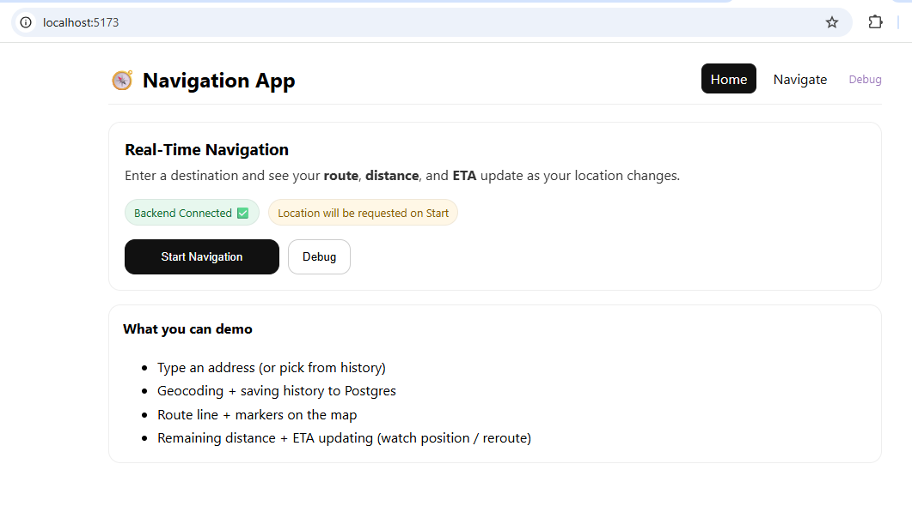
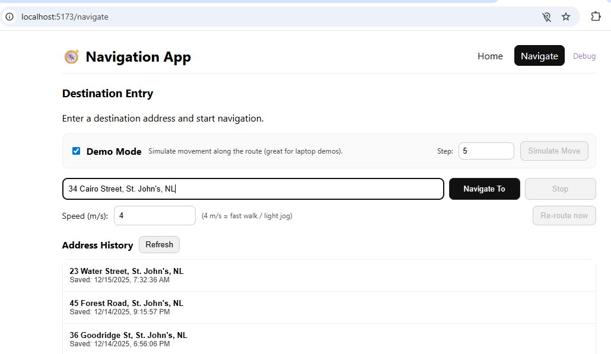
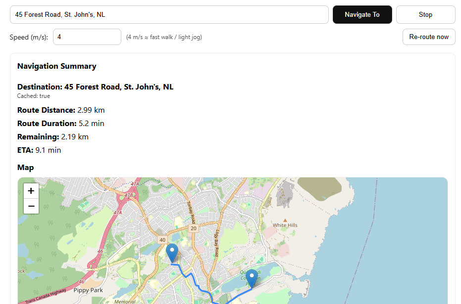
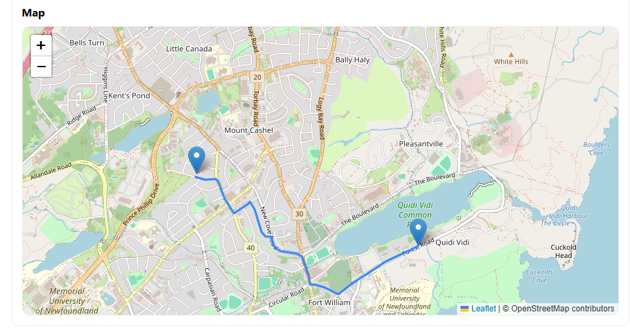
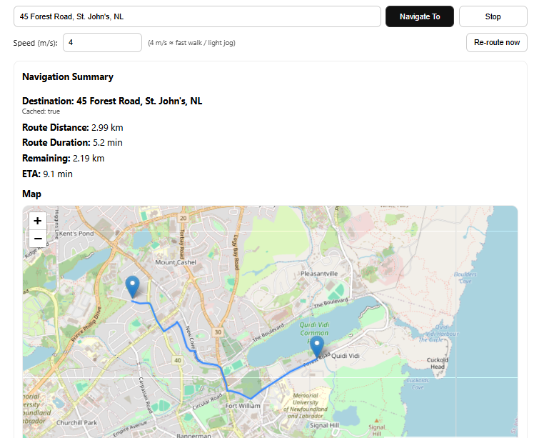
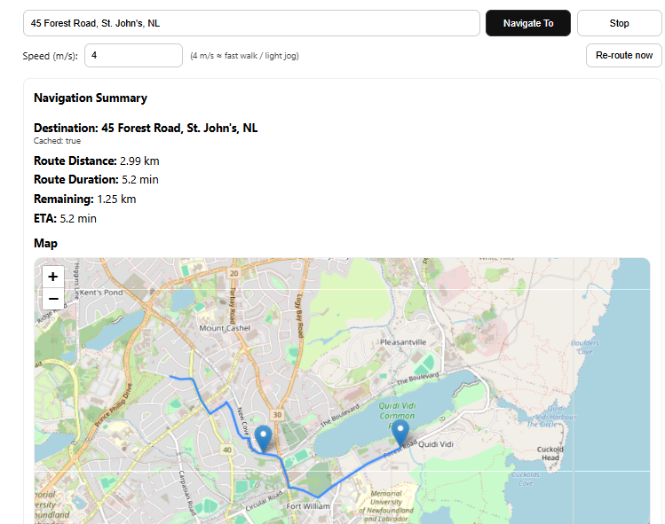
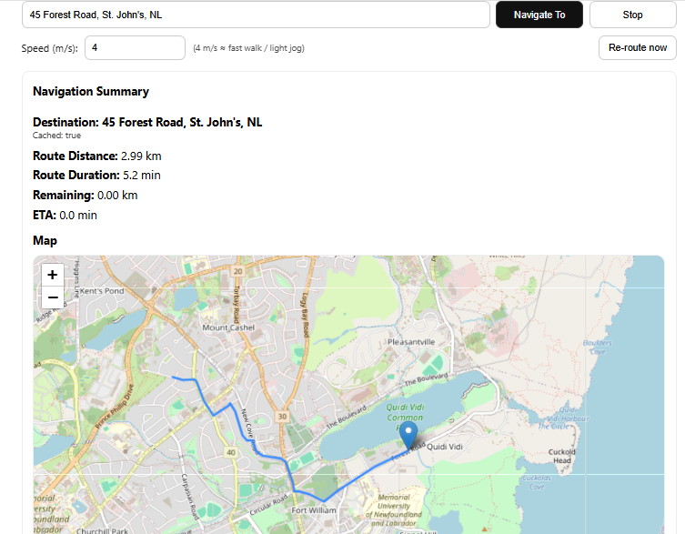
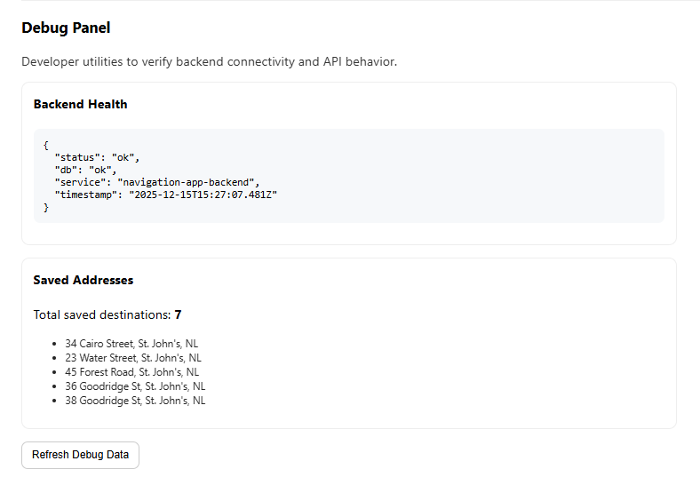

# Real-Time Navigation App — Frontend

This repository contains the **frontend** of the Real-Time Navigation App.  
It provides a web interface that allows users to enter a destination address, view an interactive map with a route, and see real-time distance and ETA updates as their location changes.

The frontend is built with **React + Vite** and communicates with a **Node.js + Express + PostgreSQL** backend via REST APIs.

---

## Features

- Request and handle **location permissions**
- Enter a **destination address**
- Display an **interactive map** using OpenStreetMap (Leaflet)
- Draw a **route line** between current location and destination
- Show **distance remaining** (km)
- Show **estimated time of arrival (ETA)**
- **Real-time updates** as the user moves
- **Address history** (previous destinations)
- Manual and automatic **re-routing**
- Ability to **stop navigation**
- Debug page to verify backend connectivity

---

## Technology Stack

- **React**
- **Vite**
- **React Router**
- **Leaflet / React-Leaflet**
- **OpenStreetMap**
- **Fetch API**
- **HTML5 Geolocation API**

---
## Project Structure
```
navigation-app-frontend/
├─ src/
│  ├─ api/
│  │  ├─ http.js
│  │  └─ navigationApi.js
│  ├─ components/
│  │  ├─ Layout.jsx
│  │  └─ RouteMap.jsx
│  ├─ pages/
│  │  ├─ Home.jsx
│  │  ├─ Navigate.jsx
│  │  └─ Debug.jsx
│  ├─ utils/
│  │  └─ format.js
│  ├─ App.jsx
│  └─ main.jsx
├─ .env.example
├─ package.json
└─ README.md
```
---
## Setup Instructions

### Prerequisites

Make sure you have:
- **Node.js (v18 or later)**
- The **backend server running locally**

---

### Install Dependencies

```bash
npm install
```
---
## Environment Variables

Create a .env file in the project root:
```
VITE_API_BASE_URL=http://localhost:4000
```
Use .env.example for reference

---
## Run the App
```
npm run dev
```

The app will be available at:
```
http://localhost:5173
```
---
## User Flow
**App Launch**
- User opens the app
- Browser requests location permission
- User’s current location is retrieved

**Destination Entry**

- User enters a destination address
- Address is sent to backend for geocoding
- Previously used addresses are displayed

**Navigation View**

- Interactive map is displayed
- Route line is drawn
- Distance and ETA are shown
- User location marker updates in real time
- Route recalculates when needed
---
## Screenshots

The following screenshots demonstrate that the application fulfills all assignment requirements.
### Screenshot 1 — App Launch & Backend Status

**Description:**

- Initial application load
- Backend connectivity indicator
- Entry point to start navigation (launch the app)



---
### Screenshot 2 — Destination Entry Screen

**Description:**

- Input field for entering a destination address

- Previously saved addresses visible

- “Navigate To” button
- Demo Mode available for simulated movement


---
### Screenshot 3 — Location Permission Request

**Description:**
- User enters destination address
- Browser requests permission to access the user’s location


Note: If permission was previously granted, the browser may not show this prompt again.

---
### Screenshot 4 — Navigation Summary & Live Metrics
- Displays route distance and duration
- Remaining distance and ETA updating during navigation
- Cached destination loaded from address history

---
### Screenshot 5 — Navigation View with Route Map

**Description:**

- Interactive map displaying the calculated route
- User location marker and destination marker
- Route line drawn using OpenStreetMap / Leaflet


---
### Screenshot 6 — Real-Time Navigation Updates
- Simulated user movement along the route
- Remaining distance decreases over time
- ETA updates dynamically based on current position


### Before Movement


### During Movement (Simulated)


### Arrival


---
### Screenshot 7 — Address History

**Description:**

- Previously navigated destinations are stored automatically
- Address history is loaded from the backend (PostgreSQL)
- Clicking an address pre-fills the destination input


---
### Screenshot 8 — Debug & Backend Verification

This screen is used during development to verify backend health
and confirm saved destinations in the database.

